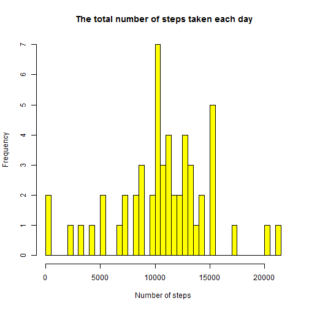
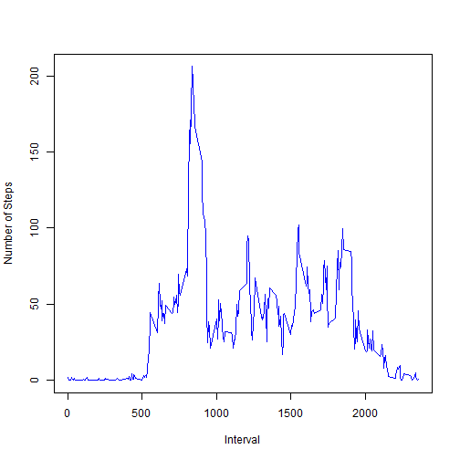
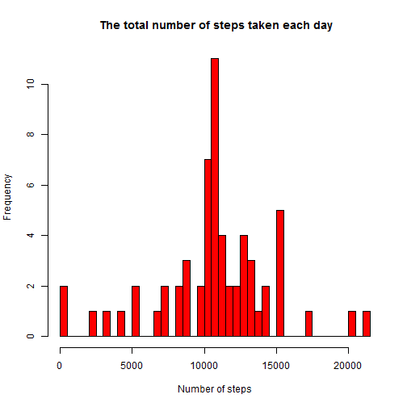
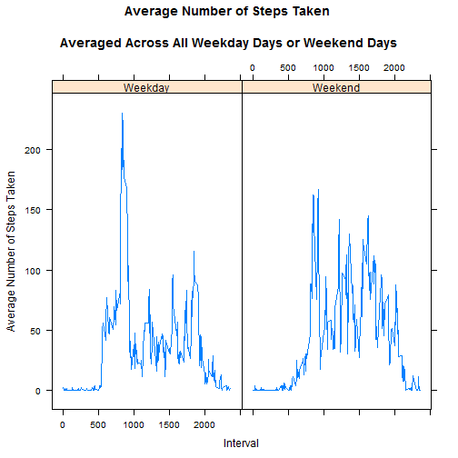

## Introduction
This assignment makes use of data from a personal activity monitoring device. This device collects data at 5 minute intervals through out the day.
The data consists of two months of data from an anonymous individual collected 
during the months of October and November, 2012 and include the number of steps taken in 5 minute intervals each day.
This document presents the results of the Reproducible Research's Peer Assessment 1 in a report using a single R markdown document that can be processed by knitr and be transformed into an HTML file.

### Loading and preprocessing the data

- Load input data from a zip file from the current R working directory
- Convert date to date data type


```r
activity <- read.csv("activity.csv")
activity$date <- as.Date(activity$date)
```

### What is mean total number of steps taken per day?

- Create a new dataset ignoring missing data NA
- Plot a histogram of the total number of steps taken each day
- Report the mean and median total number of steps taken per day


```r
library(dplyr)
mydata <- na.omit(activity)
c <- select(mydata, steps)
d <- select(mydata, date)
x <- cbind(c,d)
y <- group_by(x, date) %>% summarise_each(funs(sum))
newY <- sapply(y$steps, as.numeric)
hist(newY, main=" The total number of steps taken each day", xlab="Number of steps", col="yellow", breaks=53)
```

 

```r
m <- mean(newY)
print(m)
```

```
## [1] 10766.19
```

```r
med <- median(newY)
print(med)
```

```
## [1] 10765
```

- The mean total number of steps taken each day: 10766.19
- The median total number of steps taken each day: 10765

### What is the average daily activity pattern?

- Calculate average steps for each of 5-minute interval during a 24-hour period.
- Make a time series plot (i.e. type = "l") of the 5-minute interval (x-axis) and the average number of steps taken, averaged across all days (y-axis)
- Report which 5-minute interval, on average across all the days in the dataset, contains the maximum number of steps?    


```r
ws <- select(mydata, steps)
wi <- select (mydata, interval)
w <- cbind(ws,wi)
hg <- group_by(w, interval) %>% summarise_each(funs(mean))
plot(x=hg$interval, y=hg$steps, type="l", col="blue",xlab="Interval", ylab="Number of Steps", main="")
```

 

```r
        hg$interval[which.max(hg$steps)]        
```

```
## [1] 835
```

- The 835th 5-minute interval contains the maximum number of steps.

### Imputing missing values        

- Calculate and report the total number of missing values in the dataset (i.e. the total number of rows with NAs)
- Implement a strategy for filling in all of the missing values in the dataset. For this assignment the strategy is to use the mean for that 5-minute interval to replace missing valuse. Create a new dataset that is equal to the original dataset but with the missing data filled in.
- Make a histogram of the total number of steps taken each day
- Calculate and report the mean and median total number of steps taken per day.
- Make following comments: Do these values differ from the estimates from the first part of the assignment? What is the impact of imputing missing data on the estimates of the total daily number of steps?


```r
sum(is.na(activity))
```

```
## [1] 2304
```

- The total number of missing values in the dataset: 2304


I calculate the mean/median for the particular interval (from all days) and fill in all of the missing values in the dataset and create a new dataset.


```r
a <- select(mydata, interval)
ab <- cbind(a,c)
int <-group_by(ab, interval) %>% summarise_each(funs(mean))
activity2 <- activity
for (i in 1:nrow(activity2)){
        if (is.na(activity2$steps[i])){
                for (j in 1:nrow(int)){
                        if (int$interval[j] == activity2$interval[i]){
                                activity2$steps[i] <- int$step[j]
                        }
                }
        }
}

c2 <- select(activity2, steps)
d2 <- select(activity2, date)
x2 <- cbind(c2,d2)
y2 <- group_by(x2, date) %>% summarise_each(funs(sum))
newY2 <- sapply(y2$steps, as.numeric)
hist(newY2, main=" The total number of steps taken each day", xlab="Number of steps", col="red", breaks=53)
```

 

```r
m2 <- mean(newY2)
print(m2)
```

```
## [1] 10766.19
```

```r
med2 <- median(newY2)
print(med2)
```

```
## [1] 10766.19
```

- The new mean total number of steps taken per day: 10766.19
- The new median total number of steps taken per day: 10766.19

- Comparing with the calculations done in the first section of this document, we observe that the mean value remains unchanged and the median value now matches the mean value.

- We can see that our data resembles a t-student distribution, because the impact of imputing missing values has been an increase of the central peak, but doesn't affect the other measurements and so doesn't have a great influence on our predictions.

### Are there differences in activity patterns between weekdays and weekends?

- Create a new factor variable in the dataset with two levels - "weekday" and "weekend" indicating whether a given date is a weekday or weekend day.
- Make a panel plot containing a time series plot (i.e. type = "l") of the 5-minute interval (x-axis) and the average number of steps taken, averaged across all weekday days or weekend days (y-axis). 


```r
library(dplyr)
Sys.setlocale("LC_TIME", "English")
```

```
## [1] "English_United States.1252"
```

```r
activity2$daytype <- weekdays(as.Date(activity2$date))
for (k in 1:nrow(activity2)){
        if ( (activity2$daytype[k] == "Sunday")
          || (activity2$daytype[k] == "Saturday")
           ){
                activity2$daytype[k] <- "weekend"
        }
        else{
                activity2$daytype[k] <- "weekday"
        }
}

wd <- subset(activity2, daytype=="weekend")
wy <- subset(activity2, daytype=="weekday")
wds <- select(wd, steps)
wdi <- select(wd, interval)
newwd <- cbind(wds,wdi)
g1 <- group_by(newwd, interval) %>% summarise_each(funs(mean))
g1$daytype <- "Weekend"
wys <- select(wy, steps)
wyi <- select(wy, interval)
newwy <- cbind(wys,wyi)
q1 <- group_by(newwy, interval) %>% summarise_each(funs(mean))
q1$daytype <- "Weekday"
df <- rbind(g1,q1)
library("lattice")
p <- xyplot(steps ~ interval | factor(daytype), data=df, 
            type = "l",
            main="Average Number of Steps Taken 
       \nAveraged Across All Weekday Days or Weekend Days",
            xlab="Interval",
            ylab="Average Number of Steps Taken")
print (p)    
```

 

- Are there differences in activity patterns between weekdays and weekends? Yes. The plot indicates that the person moves around more (or more active) during the weekend days.
